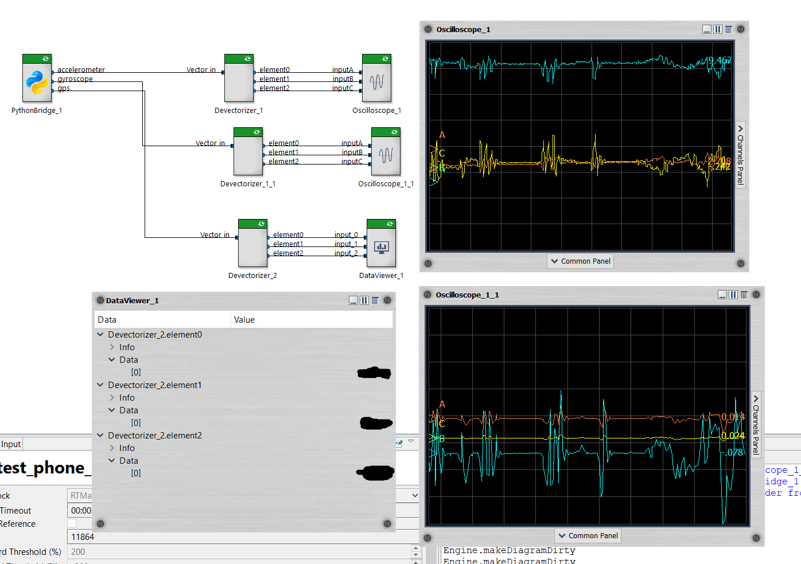

# Smartphone sensors

## Goal of this package

The goal is to use your smartphone as "sensor" into RTMaps studio, and retrieve accelerometer and GPS data.
This is nice to perform quick demos and small projects with RTMaps.

## Getting started

On your Android phone, download the SensorServer app : https://github.com/umer0586/SensorServer
Other possibility, you can use the APK on this git to sideload this application.
If you plan to use the GPS, make sure to activate the authorization on your phone to use the localisation. This is not enabled by default.

## PythonBridge component
 
 Integration is done through PythonBridge component. The script is called `get_phone_sensors.py`.
 PythonBridge version required is 4.4.3 minimum. Please update your package using "Check For Updates" in RTMaps studio.

 Parameters used:
 - IP : IP address of your phone
 - port : 8080 by default, but you can change it on the android application and PythonBridge property

## Remarks
The laptop and smartphone have to be on the same network. You can also activate the option to use your smartphone as hotspot if you are not at home / the office.
Communication is done through websockets, so performance is not high. Enough though for quick demos and small projects.

## How it looks like

